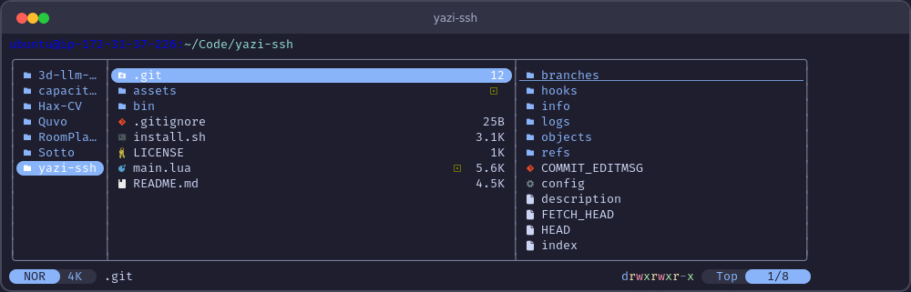
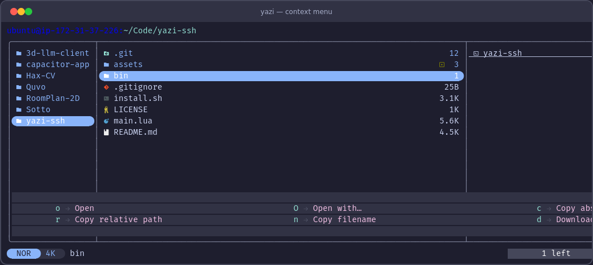
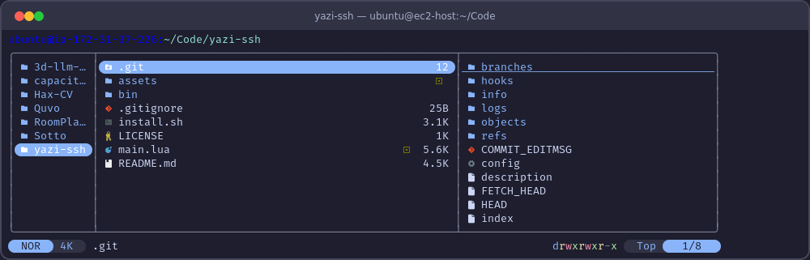

# yazi-ssh

Browse remote filesystems in [yazi](https://github.com/sxyazi/yazi) over SSH — like VS Code Remote, but in your terminal.

Right-click any file or folder to open, download, or copy its path.



## Features

- **SSH into server, browse natively** — yazi runs on the remote machine for instant disk I/O (no network lag per `ls`)
- **Right-click context menu** — the first context menu plugin for any terminal file manager
- **Download via scp** — copy remote files/folders to your local `~/Downloads`
- **Copy paths** — absolute, relative, or filename to clipboard
- **Auto-provisioning** — wrapper deploys the plugin, keymap, and init.lua to the server automatically
- **Works locally too** — the context menu works on local files without SSH

## Context menu

Right-click a file or folder (or press `m`) to open the menu:



| Key | Action | Description |
|-----|--------|-------------|
| `o` | Open | Open with default program |
| `O` | Open with... | Choose which program to open with |
| `c` | Copy path | Absolute path (or `user@host:path` in SSH mode) |
| `r` | Copy relative path | Relative to current directory |
| `n` | Copy filename | Just the filename |
| `d` | Download | Queue for scp download (SSH) or copy locally |

In SSH mode, "Copy path" returns the real remote path (e.g., `user@host:~/Code/file.py`).

## Requirements

- [yazi](https://yazi-rs.github.io/docs/installation/) >= 25.2 on **both local and server**
- `ssh` and `scp` (pre-installed on macOS and Linux)

No sshfs, no macFUSE, no kernel extensions.

## How it works

```
Mac (local)                         Server (remote)
 |                                    |
 |--- ssh ControlMaster (bg) ------->| persistent auth socket
 |--- ssh (foreground, -t) --------->| yazi runs HERE (fast)
 |                                    |   plugin appends to queue file
 |--- ssh (background) ------------->| tail -n 0 -f queue
 |<-- scp (per download) ------------|   piped to process_downloads()
 |    saves to ~/Downloads            |
```

All SSH connections share one ControlMaster socket — single authentication, zero overhead. The wrapper:

1. Establishes a ControlMaster connection
2. Checks that yazi is installed on the server
3. Auto-provisions the plugin, keymap binding, and right-click handler
4. Creates a queue file on the server for download requests
5. Starts a background watcher that tails the queue and runs `scp` for each path
6. Launches yazi on the server with a TTY (foreground)
7. Cleans up on exit — kills watcher, removes queue file, closes ControlMaster

Downloads happen asynchronously: press `d` in the menu, and scp transfers run in the background while you keep browsing.

## Installation

### Full install (SSH + context menu)

```bash
git clone https://github.com/affromero/yazi-ssh.git /tmp/yazi-ssh
bash /tmp/yazi-ssh/install.sh
```

This installs:
1. The context menu plugin (via `ya pkg`)
2. The `yazi-ssh` wrapper script to `~/.local/bin/`
3. Right-click handler in `~/.config/yazi/init.lua`

### Plugin only (context menu without SSH)

If you just want the right-click context menu for local files:

```bash
ya pkg add affromero/yazi-ssh
```

Then add the right-click handler to `~/.config/yazi/init.lua`:

```lua
-- Right-click context menu (yazi-ssh)
local original_entity_click = Entity.click
function Entity:click(event, up)
	if up or event.is_middle then
		return
	end
	ya.emit("reveal", { self._file.url })
	if event.is_right then
		ya.emit("plugin", { "yazi-ssh" })
	else
		original_entity_click(self, event, up)
	end
end
```

And optionally add a keyboard shortcut in `~/.config/yazi/keymap.toml`:

```toml
[[mgr.prepend_keymap]]
on   = "m"
run  = "plugin yazi-ssh"
desc = "Context menu"
```

## Usage

### Remote browsing



```bash
# Basic
yazi-ssh user@myserver

# With SSH key and remote path
yazi-ssh -i ~/.ssh/key.pem ubuntu@ec2-host:~/Code

# Custom port
yazi-ssh -p 2222 user@host:/var/www

# Download to a custom directory
yazi-ssh -d ~/Desktop user@host:~/projects
```

### Local context menu

Just right-click any file or folder in yazi, or press `m`.

## Configuration

### Download directory

Default: `~/Downloads`

Set via environment variable:

```bash
export YAZI_SSH_DOWNLOAD_DIR="$HOME/Desktop"
```

Or pass `-d` to the wrapper:

```bash
yazi-ssh -d ~/Desktop user@host:~/Code
```

### SSH options

Pass extra SSH options with `-o`:

```bash
yazi-ssh -o "Compression=yes" -o "Ciphers=aes128-ctr" user@host:~/Code
```

## Environment variables

These are set automatically by the `yazi-ssh` wrapper. The plugin reads them to detect SSH mode:

| Variable | Set by | Read by | Description |
|----------|--------|---------|-------------|
| `YAZI_SSH_REMOTE` | wrapper | plugin | `user@host` string |
| `YAZI_SSH_QUEUE` | wrapper | plugin | Queue file path on server |
| `YAZI_SSH_DOWNLOAD_DIR` | user/wrapper | wrapper | Local download directory |

## License

MIT
